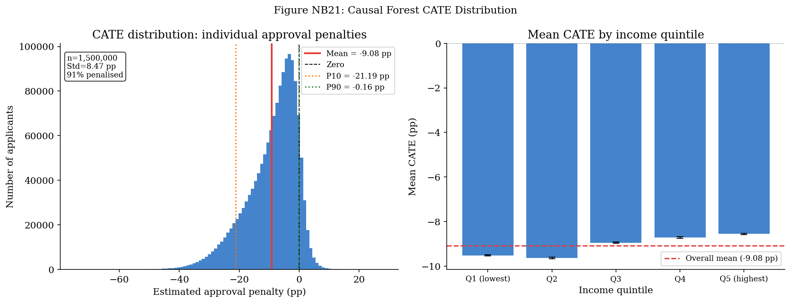
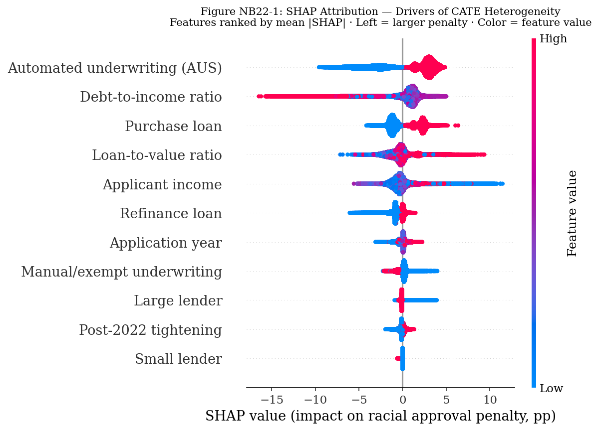
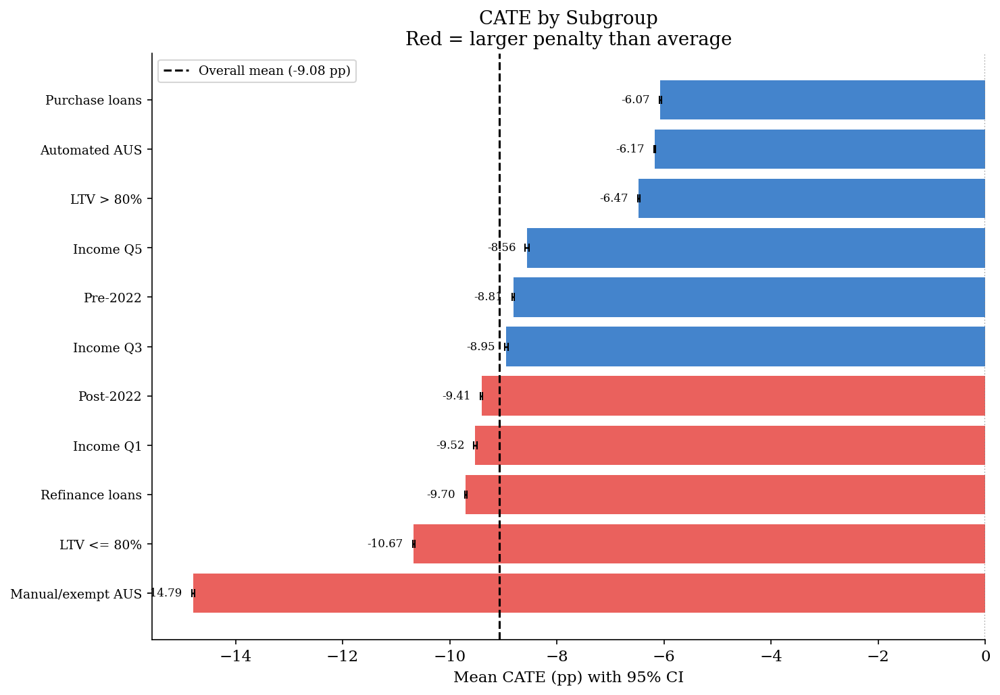

# Heterogeneous Treatment Effects in Mortgage Lending
### Mapping the Conditional Racial Approval Penalty Across 42 Million U.S. Applications

**Author:** Rajveer Singh Pall  
**Institution:** Gyan Ganga Institute of Technology and Sciences  
**Status:** Work in progress — arXiv preprint targeted Month 5

---

## Overview

This repository extends [Persistent Racial Disparities in U.S. Mortgage Approval: Evidence from 42 Million Applications, 2020–2024](https://github.com/YOUR_USERNAME/HMDA-Racial-Disparities) — a companion paper documenting an average within-lender racial approval penalty of **10.6 percentage points** using regression discontinuity, difference-in-differences, and DFL decomposition.

That paper answers: *Is there a racial approval gap?*  
This project answers: *For whom is it largest — and why?*

Using Causal Forests (Wager & Athey, 2018) and Double Machine Learning (Chernozhukov et al., 2018), we estimate the **Conditional Average Treatment Effect (CATE)** of being a Black applicant on mortgage approval probability across the full distribution of 42 million applicants. We then map how the approval penalty varies across income decile, loan-to-value ratio, lender tier, and loan purpose — identifying the applicant profiles most severely affected by institutional discretion.

### Key questions

1. Is the 10.6 pp average penalty uniform, or does it mask severe heterogeneity?
2. Is discrimination largest for high-income applicants (suggesting animus) or lower-income, higher-LTV applicants (suggesting structural risk aversion)?
3. Is the 2.0 pp PMI boundary effect (at 80% LTV) concentrated in specific applicant subgroups?
4. Did the 2022 Fed tightening cycle widen the gap uniformly, or did it amplify existing disparities for already-disadvantaged applicants?

---

## Companion repository

**Repo 1 (published paper):** [HMDA-Racial-Disparities](https://github.com/YOUR_USERNAME/HMDA-Racial-Disparities)  
Contains 16 notebooks covering data cleaning, DFL decomposition, within-lender fixed effects, LTV-RDD, tightening-DiD, permutation inference, and all manuscript tables and figures.

This repository (Repo 2) uses the processed panel files from Repo 1 as inputs.

---

## Methodology

### Double Machine Learning (Chernozhukov et al., 2018)
DML handles high-dimensional covariates (100+ features including income, LTV, loan purpose, property type, occupancy type, lender size, geographic dummies) by:
1. Residualising the treatment (Black indicator) on all covariates using LightGBM
2. Residualising the outcome (approval) on all covariates using LightGBM
3. Regressing outcome residuals on treatment residuals

5-fold cross-fitting eliminates regularisation bias. Standard errors clustered at the lender (LEI) level.

### Causal Forests (Wager & Athey, 2018) via CausalForestDML
Grows 500 trees that split on covariates maximising treatment effect heterogeneity (not prediction accuracy). Honest splitting — training and estimation samples are separate within each tree. Produces a CATE estimate for every individual applicant.

### SHAP Attribution
`shap.TreeExplainer` on the fitted Causal Forest identifies which covariates drive heterogeneity in treatment effects, producing the personalised disparity map.

---

## Repository structure

```
CATE-HMDA-Heterogeneous-Effects/
│
├── README.md
├── requirements.txt
├── environment.yml
├── .gitignore
│
├── notebooks/
│   ├── NB17_feature_engineering.ipynb
│   ├── NB18_overlap_diagnostics.ipynb
│   ├── NB19_double_ml_baseline.ipynb
│   ├── NB20_nonparam_dml_cate.ipynb
│   ├── NB21_causal_forest_cate.ipynb
│   ├── NB22_shap_attribution.ipynb
│   ├── NB23_disparity_map.ipynb
│   ├── NB24_subgroup_rdd.ipynb
│   ├── NB25_subgroup_did.ipynb
│   └── NB26_paper_figures.ipynb
│
├── outputs/
│   ├── tables/          # CSV and LaTeX tables (generated)
│   └── figures/         # PNG and PDF figures (generated)
│
├── data/
│   └── README.md        # Data download instructions (no data committed)
│
└── paper/
    └── CATE_HMDA_draft.tex
```

---

## Data

**Source:** [CFPB HMDA Public Loan-Level Datasets](https://ffiec.cfpb.gov/data-browser/)  
Years: 2020–2024 | Observations: 42,323,519 | Lenders: 5,500+

**This repository does not contain data files.** Raw HMDA CSVs are publicly available at the link above. Processed panel CSVs are generated by Repo 1 (notebooks 01 and 02).

### Required data files (place in `data/` before running)

| File | Source | Size (approx) |
|------|--------|---------------|
| `hmda_2020.csv` through `hmda_2024.csv` | CFPB HMDA portal | ~2–4 GB each |
| `processed/panel_2020.csv` through `panel_2024.csv` | Generated by Repo 1, NB01 | ~500 MB each |

---

## Installation

```bash
# 1. Clone this repository
git clone https://github.com/YOUR_USERNAME/CATE-HMDA-Heterogeneous-Effects.git
cd CATE-HMDA-Heterogeneous-Effects

# 2. Create conda environment
conda env create -f environment.yml
conda activate cate_hmda

# 3. Register the kernel for Jupyter
python -m ipykernel install --user --name cate_hmda --display-name "CATE-HMDA"

# 4. Place data files in data/ (see Data section above)

# 5. Run notebooks in order: NB17 → NB18 → ... → NB26
```

---

## Notebook pipeline

| Notebook | Description | Runtime (est.) | Key output |
|----------|-------------|---------------|------------|
| NB17 | Feature engineering | 20–40 min | `features_panel.parquet` |
| NB18 | Overlap diagnostics | 10–20 min | Propensity score plots, trimmed sample |
| NB19 | Double ML baseline (LinearDML) | 20–40 min | ATE ≈ −10.6 pp (sanity check) |
| NB20 | NonParamDML CATE | 30–60 min | First CATE distribution plot |
| NB21 | CausalForestDML | 60–120 min | Individual CATE estimates |
| NB22 | SHAP attribution | 10–20 min | Heterogeneity drivers |
| NB23 | Disparity map | 5–10 min | Income × LTV × lender-tier heatmap |
| NB24 | Subgroup RDD | 20–40 min | PMI boundary effect by subgroup |
| NB25 | Subgroup DiD | 20–40 min | Tightening cycle effect by CATE quartile |
| NB26 | Paper figures | 10–20 min | All manuscript figures |

**Total runtime:** approximately 3.5–7 hours (hardware: i7-13650HX, 16GB RAM)

---

## Key Results

### CATE Distribution — The average hides everything


### SHAP Attribution — What drives heterogeneity


### Subgroup Analysis


## References

- Wager, S., & Athey, S. (2018). Estimation and inference of heterogeneous treatment effects using random forests. *Journal of the American Statistical Association*, 113(523), 1228–1242.
- Chernozhukov, V., Chetverikov, D., Demirer, M., Duflo, E., Hansen, C., Newey, W., & Robins, J. (2018). Double/debiased machine learning for treatment and structural parameters. *The Econometrics Journal*, 21(1), C1–C68.
- Bartlett, R., Morse, A., Stanton, R., & Wallace, N. (2022). Consumer-lending discrimination in the FinTech era. *Journal of Financial Economics*, 143(1), 30–56.
- Lundberg, S. M., & Lee, S. I. (2017). A unified approach to interpreting model predictions. *NeurIPS*, 30.

---

## Citation

If you use this code, please cite both this repository and the companion paper:

```bibtex
@misc{pall2026cate,
  author = {Pall, Rajveer Singh},
  title  = {Heterogeneous Treatment Effects in Mortgage Lending},
  year   = {2026},
  url    = {https://github.com/YOUR_USERNAME/CATE-HMDA-Heterogeneous-Effects}
}
```

---

## License

Code: MIT License  
Data: Subject to CFPB HMDA public data terms
