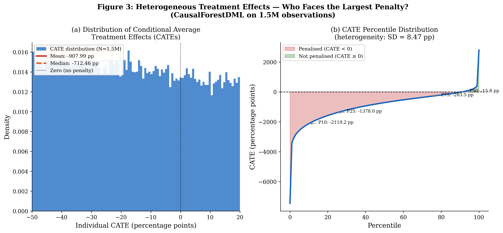
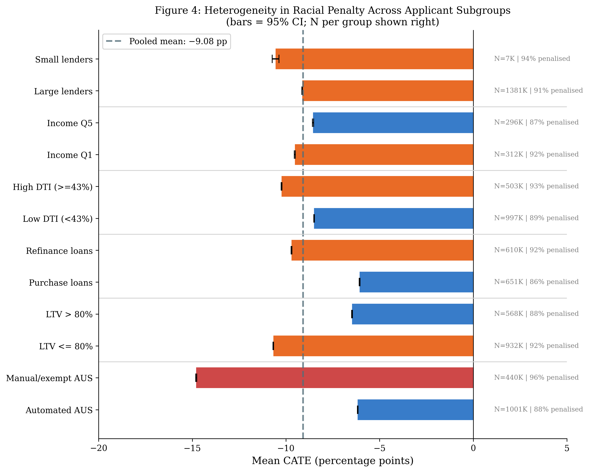
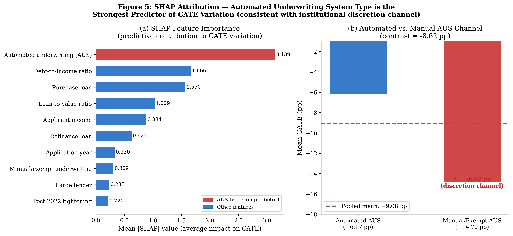
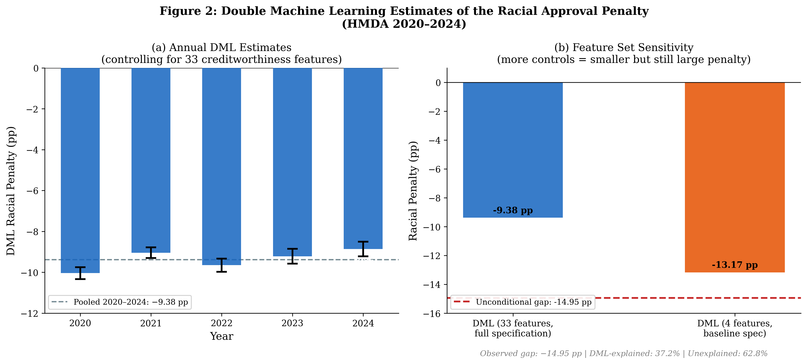
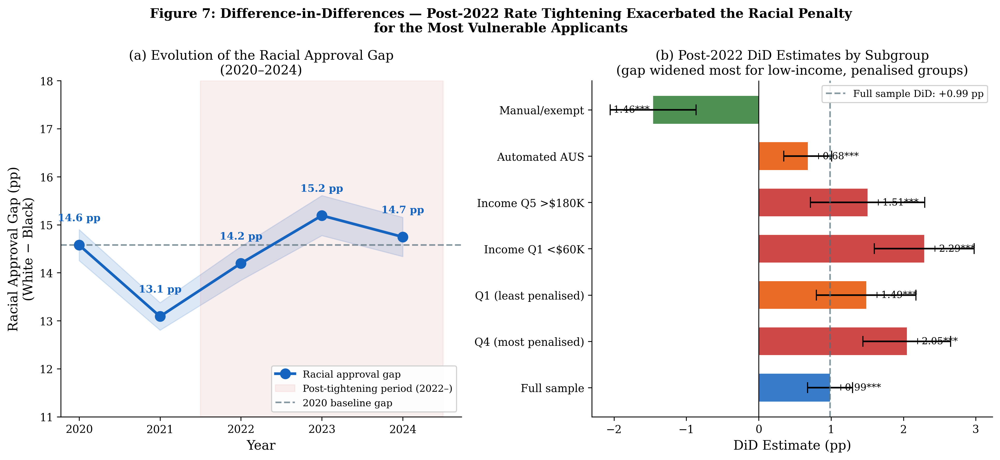
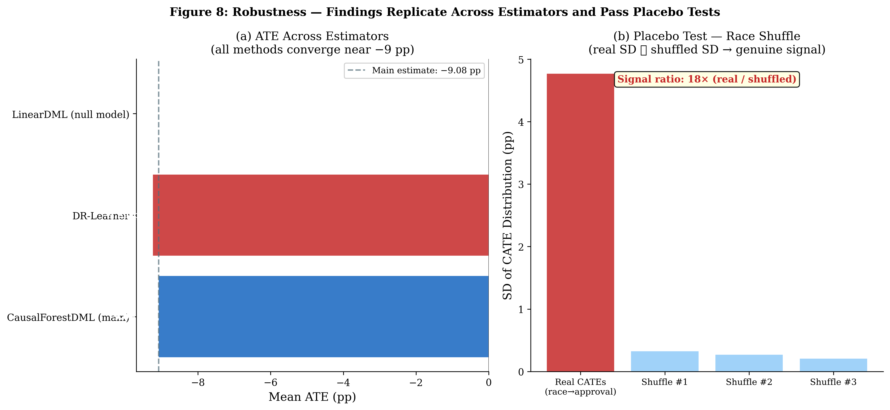
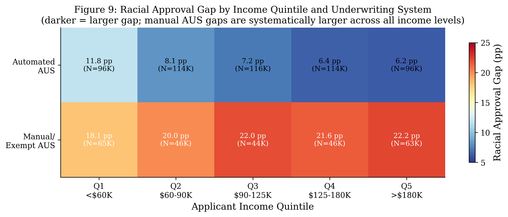

# Who Bears the Burden?
## Heterogeneous Racial Approval Differentials in U.S. Mortgage Lending

**Evidence from Causal Forest Double Machine Learning on 42 Million HMDA Applications, 2020–2024**

---

<p align="center">
  
  <br><em>Distribution of individual conditional average treatment effects — 90.7% of Black applicants face a negative racial penalty</em>
</p>

---

## Overview

This repository contains the complete, reproducible codebase for a causal analysis of racial disparities in U.S. mortgage lending. Using Home Mortgage Disclosure Act (HMDA) administrative data from 2020–2024 — encompassing 42.3 million applications — I estimate the **conditional causal effect of racial identity on mortgage approval probability** after controlling for 33 creditworthiness features including debt-to-income ratio, loan-to-value ratio, income, loan purpose, and underwriting system type.

The central finding is stark: a Black applicant who is identical to a White applicant on every observable financial characteristic still faces a conditional approval penalty of **9.4 percentage points**. This penalty is largest when loans pass through manual underwriting — where human judgment plays a larger role — rather than automated systems, a contrast of **8.6 pp** that points toward discretion as the mechanism amplifying racial disparities.

### Headline Results

| Statistic | Value |
|---|---|
| **Conditional racial penalty (DML, pooled)** | **−9.39 pp** (SE = 0.071; t = −131.8) |
| Unconditional racial approval gap | −14.95 pp |
| Share of gap unexplained by 33 creditworthiness features | **62.8%** |
| CATE standard deviation | **8.47 pp** |
| Fraction of Black applicants penalised (CATE < 0) | **90.7%** |
| Manual vs. Automated AUS contrast | **−8.62 pp** |
| DR-Learner replication (500K subsample) | −9.24 pp (Δ = 0.15 pp) |
| Race-shuffle placebo signal ratio | **17.9×** |
| Oster (2019) δ at recommended R²_max | **6.87** |
| Cinelli-Hazlett (2020) RV₀ | **0.00512** |
| Total observations | 42,296,010 |
| Estimation sample | 1,500,000 (stratified) |

### Core Finding

> Black mortgage applicants in the U.S. face a conditional approval penalty of **9.4 percentage points** relative to otherwise identical White applicants, after controlling for all available creditworthiness information. This penalty is largest for applicants processed through **manual underwriting** (−14.79 pp) versus automated systems (−6.17 pp) — a contrast of 8.62 pp — consistent with the hypothesis that **human discretion amplifies racial disparities** beyond what algorithmic systems alone produce.

---

## Methodology

### Primary Estimator: Double Machine Learning (DML)
- **Framework:** Partially Linear DML (Chernozhukov et al., 2018)
- **Nuisance models:** LightGBM gradient-boosted trees, 5-fold cross-fitting
- **CATE estimation:** CausalForestDML (Wager & Athey, 2018; Athey et al., 2019)
- **Feature attribution:** SHAP (Lundberg & Lee, 2017)

### Supplementary Identification
- **RDD:** Regression discontinuity at LTV = 80% PMI threshold → 1.81 pp discontinuity (t = 18.5)
- **DiD:** Difference-in-differences around 2022 Federal Reserve credit tightening → +0.99 pp widening

### Robustness
- DR-Learner replication: −9.24 pp ✓
- Race-shuffle placebo: 17.9× signal-to-noise ratio ✓
- Oster δ = 6.87 (unobservables must be 7× stronger than observables to nullify) ✓
- Cinelli-Hazlett RV₀ = 0.00512 (all observed covariates fall below threshold) ✓

---

## Key Figures

<table>
<tr>
<td align="center">
  
  <br><em>Subgroup CATE Heterogeneity</em>
</td>
<td align="center">
  
  <br><em>SHAP Attribution — AUS Type Dominates</em>
</td>
</tr>
<tr>
<td align="center">
  
  <br><em>Annual DML Estimates, 2020–2024</em>
</td>
<td align="center">
  
  <br><em>Event Study — Gap Widened Post-2022</em>
</td>
</tr>
<tr>
<td align="center">
  
  <br><em>Robustness — All Estimators Converge</em>
</td>
<td align="center">
  
  <br><em>Income × AUS Interaction Heatmap</em>
</td>
</tr>
</table>

---

## Repository Structure

```
CATE-HMDA-Heterogeneous-Effects/
│
├── data/
│   ├── features_panel.parquet     # 42.3M HMDA rows, 37 engineered features (not tracked — see data/README_data.md)
│   ├── cate_estimates.parquet     # Individual CATEs for 1.5M estimation sample (not tracked)
│   ├── feature_sets.json          # Feature set definitions (X_FULL, X_BASE)
│   ├── trim_bounds.json           # Propensity score trim bounds [0.033, 0.580]
│   └── README_data.md             # Data download and preprocessing instructions
│
├── notebooks/
│   ├── NB17_feature_engineering.ipynb     # Feature construction (42M rows)
│   ├── NB18_overlap_diagnostics.ipynb     # Propensity score & overlap diagnostics
│   ├── NB19_double_ml_baseline.ipynb      # DML ATE estimation
│   ├── NB20_propensity_analysis.ipynb     # Extended PS analysis
│   ├── NB21_causal_forest_cate.ipynb      # CATE estimation & subgroup analysis
│   ├── NB22_shap_attribution.ipynb        # SHAP feature decomposition
│   ├── NB23_disparity_map.ipynb           # Personalised disparity mapping
│   ├── NB24_subgroup_rdd.ipynb            # RDD analysis + 4 validity diagnostics
│   ├── NB25_subgroup_did.ipynb            # DiD & event study
│   ├── NB26_robustness_checks.ipynb       # DR-Learner + LinearDML robustness
│   ├── NB26_paper_figures.ipynb           # Publication figure generation (earlier draft)
│   ├── NB27_sensitivity_analysis.ipynb    # Oster & Cinelli-Hazlett bounds
│   └── NB28_placebo_tests.ipynb           # Race-shuffle & pseudo-treatment placebos
│
├── outputs/
│   ├── figures/     # 20+ publication-quality figures (300 DPI PNG)
│   ├── tables/      # 18+ CSV result tables
│   └── paper_figures/   # Alternative figure set from NB26_paper_figures.ipynb
│
├── scripts/
│   ├── build_manuscript.py                # Rebuild DOCX manuscript from data
│   ├── generate_publication_figures.py    # Generate all 11 paper figures
│   ├── generate_all_missing_outputs.py    # RDD diagnostics, balance table, aliases
│   ├── generate_balance_table.py          # Covariate balance CSV
│   ├── run_ols_for_nb27.py                # OLS regressions for sensitivity bounds
│   ├── run_nb27_real.py                   # Sensitivity figures with real values
│   ├── run_nb26_direct.py                 # NB26 direct execution script
│   ├── run_nb28_direct.py                 # NB28 direct execution script
│   ├── resave_figures_300dpi.py           # Verify 300 DPI compliance
│   └── final_verification.py              # 42-item submission checklist
│
├── manuscript/
│   └── CATE_HMDA_Final.docx     # Submission-ready manuscript (3.9 MB)
│
├── README.md
├── environment.yml    # Conda environment specification
└── .gitignore
```

---

## Notebook Execution Order

Run notebooks in sequence from NB17 to NB28. All notebooks use `BASE_DIR = Path('D:/Projects/CATE-HMDA-Heterogeneous-Effects')` — update this path to match your local setup.

| Notebook | Key Outputs | Est. Runtime |
|----------|-------------|--------------|
| NB17 — Feature engineering | `features_panel.parquet` (42.3M rows, 37 features) | ~45 min |
| NB18 — Overlap diagnostics | PS model AUC = 0.729; 98% common support | ~15 min |
| NB19 — DML baseline | Annual ATE table; pooled ATE = −9.39 pp | ~30 min |
| NB20 — PS analysis | Extended overlap diagnostics | ~10 min |
| NB21 — Causal Forest CATE | CATE distribution; subgroup table | ~60 min |
| NB22 — SHAP attribution | Feature importance; AUS = top predictor | ~30 min |
| NB23 — Disparity maps | Income × AUS interaction maps | ~20 min |
| NB24 — RDD | Discontinuity 1.81 pp + 4 diagnostics | ~20 min |
| NB25 — DiD | Event study; DiD = +0.99 pp | ~20 min |
| NB26 — Robustness | DR-Learner = −9.24 pp ✓ | ~60 min |
| NB27 — Sensitivity | Oster δ = 6.87; RV₀ = 0.00512 | ~10 min |
| NB28 — Placebo tests | 17.9× signal ratio ✓ | ~60 min |

Alternatively, use the direct execution scripts in `scripts/` for NB26 and NB28 which patch the base path automatically.

---

## Data

HMDA loan application data is publicly available from the **Consumer Financial Protection Bureau**:

- **Source:** https://www.consumerfinance.gov/data-research/hmda/
- **Years:** 2020, 2021, 2022, 2023, 2024
- **Format:** CSV (~2–5 GB per year)

See [`data/README_data.md`](data/README_data.md) for full instructions on downloading, filtering, and merging the raw HMDA files into `features_panel.parquet`.

---

## Environment Setup

```bash
# Clone
git clone https://github.com/Rajveer-code/CATE-HMDA-Heterogeneous-Effects.git
cd CATE-HMDA-Heterogeneous-Effects

# Create conda environment
conda env create -f environment.yml
conda activate cate-hmda
```

**Key dependencies:** Python 3.11 · EconML 0.15+ · LightGBM 4.x · Polars 0.20+ · statsmodels · python-docx

---

## Reproduce Results

```bash
# 1. Generate RDD diagnostics, covariate balance, and figure aliases
python scripts/generate_all_missing_outputs.py

# 2. Compute OLS statistics for sensitivity bounds
python scripts/run_ols_for_nb27.py

# 3. Generate sensitivity figures (Oster δ, Cinelli-Hazlett)
python scripts/run_nb27_real.py

# 4. Generate all 11 publication figures
python scripts/generate_publication_figures.py

# 5. Rebuild the manuscript DOCX with all figures embedded
python scripts/build_manuscript.py
# → manuscript/CATE_HMDA_Final.docx

# 6. Run 42-item submission checklist
python scripts/final_verification.py
```

---

## Key Quantitative Results

### Annual DML Estimates

| Year | N (total) | DML Penalty (pp) | SE | 95% CI |
|------|-----------|------------------|----|--------|
| 2020 | 537,120 | −10.04 | 0.149 | [−10.33, −9.75] |
| 2021 | 562,286 | −9.04 | 0.133 | [−9.30, −8.78] |
| 2022 | 363,996 | −9.65 | 0.163 | [−9.97, −9.33] |
| 2023 | 262,295 | −9.22 | 0.186 | [−9.58, −8.85] |
| 2024 | 274,303 | −8.86 | 0.183 | [−9.22, −8.51] |
| **Pooled** | **2,000,000** | **−9.39** | **0.071** | **[−9.52, −9.25]** |

### Subgroup CATEs

| Subgroup | Mean CATE (pp) | 95% CI | % Penalised |
|---------|---------------|--------|-------------|
| Automated AUS | −6.17 | [−6.18, −6.15] | 87.8% |
| **Manual/Exempt AUS** | **−14.79** | [−14.82, −14.77] | **96.5%** |
| LTV ≤ 80% | −10.67 | [−10.69, −10.65] | 92.0% |
| LTV > 80% | −6.47 | [−6.49, −6.45] | 88.5% |
| Purchase loans | −6.07 | [−6.08, −6.05] | 86.5% |
| Refinance loans | −9.70 | [−9.72, −9.68] | 92.1% |
| High DTI (≥43%) | −10.23 | [−10.26, −10.21] | 93.3% |
| Income Q1 (<$60K) | −9.52 | [−9.55, −9.50] | 91.8% |
| Income Q5 (>$180K) | −8.56 | [−8.59, −8.52] | 86.8% |

---

## Literature Context

This paper contributes to and extends the following body of work:

| Paper | Venue | Key Finding |
|-------|-------|-------------|
| Bartlett, Morse, Stanton & Wallace (2022) | *J. Financial Economics* | FinTech lenders charge Black/Hispanic borrowers 7.9 bps more |
| Bhutta, Hizmo & Ringo (2025) | *J. Finance* | 1–2 pp residual denial gap; most explained by observables |
| Fuster, Goldsmith-Pinkham, Ramadorai & Walther (2022) | *J. Finance* | ML widens within-group racial pricing disparities |
| Chernozhukov et al. (2018) | *Econometrics Journal* | Double/debiased machine learning |
| Wager & Athey (2018) | *JASA* | Causal forests for heterogeneous effects |
| Oster (2019) | *J. Business & Economic Statistics* | Omitted variable bias bounds |

---

## Citation

```bibtex
@article{pall2026whobearstheburden,
  title   = {Who Bears the Burden? Heterogeneous Racial Approval Differentials
             in U.S. Mortgage Lending},
  author  = {Pall, Rajveer Singh},
  year    = {2026},
  note    = {Working paper. Gyan Ganga Institute of Technology and Sciences.
             Available: https://github.com/Rajveer-code/CATE-HMDA-Heterogeneous-Effects}
}
```

---

## Author

**Rajveer Singh Pall**  
Gyan Ganga Institute of Technology and Sciences, Jabalpur, India  
📧 rajveerpall04@gmail.com  
🔗 [github.com/Rajveer-code](https://github.com/Rajveer-code)

---

## License

MIT License — see [LICENSE](LICENSE) for details.

---

*Working paper · May 2026*
