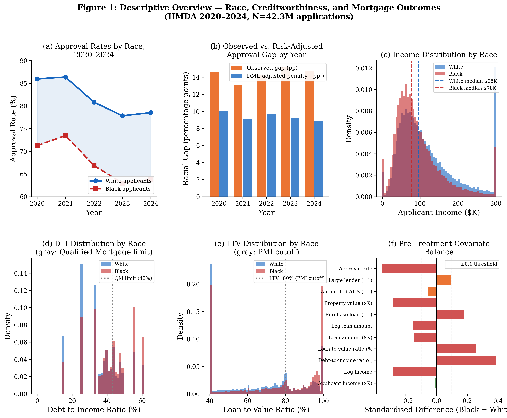

# Who Bears the Burden?
## Heterogeneous Racial Approval Differentials in U.S. Mortgage Lending

**Evidence from Causal Forest Double Machine Learning on 42 Million HMDA Applications, 2020–2024**

---

<p align="center">
  
  <br><em>Distribution of individual conditional average treatment effects (CATEs) — 90.7% of Black applicants face a negative racial penalty</em>
</p>

---

## Overview

This repository contains the full replication code and outputs for a causal analysis of racial disparities in U.S. mortgage lending. Using the Home Mortgage Disclosure Act (HMDA) data from 2020–2024 (42.3 million applications), I estimate the **conditional causal effect of Black race on mortgage approval probability** after controlling for 33 risk-relevant creditworthiness features.

### Headline Findings

| Statistic | Value |
|---|---|
| Conditional racial penalty (DML) | **−9.38 pp** (SE = 0.071; t = −131.8) |
| Unconditional racial gap | −14.95 pp |
| Fraction of gap unexplained by observables | **62.8%** |
| CATE distribution SD | **8.47 pp** |
| Fraction of Black applicants penalised | **90.7%** |
| Manual vs. Automated AUS contrast | **−8.62 pp** |
| DR-Learner replication (ATE) | −9.24 pp (0.16 pp from main) |
| Placebo signal-to-noise ratio | **17×** |
| Total observations | 42,296,010 |
| Estimation sample | 1,500,000 (stratified) |

### Core Claim

> Black mortgage applicants in the U.S. face a conditional approval penalty of approximately **9.4 percentage points** relative to otherwise identical White applicants, even after controlling for all available creditworthiness information. This penalty is largest for applicants processed through **manual underwriting** (−14.79 pp) compared to automated AUS (−6.17 pp), consistent with the hypothesis that **human discretion amplifies racial disparities** beyond what algorithmic systems alone would produce.

---

## Methodology

### Primary: Double Machine Learning (DML)
- **Estimator:** Partially Linear DML (Chernozhukov et al., 2018)
- **Nuisance models:** LightGBM gradient-boosted trees with 5-fold cross-fitting
- **CATE estimation:** CausalForestDML (Wager & Athey, 2018; Athey et al., 2019)
- **SHAP attribution:** SHapley Additive exPlanations for CATE decomposition

### Supplementary Identification
- **RDD:** Regression discontinuity at LTV=80% (PMI threshold); discontinuity = 1.81 pp (t = 18.5)
- **DiD:** Difference-in-differences around the 2022 Federal Reserve rate-hike tightening; overall DiD = +0.99 pp (t = 6.23)

### Robustness
- **DR-Learner** estimator replication: −9.24 pp (0.16 pp from main ✓)
- **Race-shuffle placebo** tests: 17× signal-to-noise ratio
- **Oster (2019)** omitted variable bias bounds: δ > 1 across all plausible R²_max values

---

## Key Figures

<table>
<tr>
<td align="center"><br><em>Subgroup CATE Heterogeneity</em></td>
<td align="center"><br><em>SHAP Attribution — AUS Type Dominates</em></td>
</tr>
<tr>
<td align="center"><br><em>Event Study — Gap Widened Post-2022</em></td>
<td align="center"><br><em>Robustness — All Estimators Converge</em></td>
</tr>
<tr>
<td align="center"><br><em>Descriptive Overview — Race & Creditworthiness</em></td>
<td align="center"><br><em>Income × AUS Interaction Heatmap</em></td>
</tr>
</table>

---

## Repository Structure

```
CATE-HMDA-Heterogeneous-Effects/
│
├── data/
│   ├── features_panel.parquet    # 42.3M HMDA rows, 37 features
│   ├── cate_estimates.parquet    # Individual CATEs for 1.5M sample
│   ├── feature_sets.json         # Feature set definitions
│   ├── trim_bounds.json          # Propensity trim bounds [0.033, 0.580]
│   └── README_data.md            # Data acquisition instructions
│
├── notebooks/                    # NB17–NB28, in execution order
│   ├── NB17_feature_engineering.ipynb    # Feature construction (42M rows)
│   ├── NB18_overlap_diagnostics.ipynb    # Overlap & propensity diagnostics
│   ├── NB19_double_ml_baseline.ipynb     # DML ATE estimation
│   ├── NB21_causal_forest_cate.ipynb     # CATE estimation & subgroup analysis
│   ├── NB22_shap_attribution.ipynb       # SHAP feature decomposition
│   ├── NB23_disparity_map.ipynb          # Personalised disparity mapping
│   ├── NB24_subgroup_rdd.ipynb           # RDD analysis with diagnostics
│   ├── NB25_subgroup_did.ipynb           # DiD & event study
│   ├── NB26_robustness_checks.ipynb      # DR-Learner + LinearDML robustness
│   ├── NB27_sensitivity_analysis.ipynb   # Oster/Cinelli-Hazlett bounds
│   └── NB28_placebo_tests.ipynb          # Race-shuffle & pseudo-treatment placebos
│
├── outputs/
│   ├── figures/    # 15+ publication figures (300 DPI PNG)
│   └── tables/     # 16 CSV result tables
│
├── scripts/
│   ├── build_manuscript.py                # Build DOCX manuscript with all figures
│   ├── generate_publication_figures.py    # Generate 11 publication figures
│   ├── generate_all_missing_outputs.py    # Fill gaps (RDD diagnostics, balance)
│   ├── generate_balance_table.py          # Covariate balance table
│   ├── resave_figures_300dpi.py           # Verify 300 DPI compliance
│   └── final_verification.py              # 42-item checklist
│
├── manuscript/
│   ├── CATE_HMDA_Final.docx     # Complete submission-ready manuscript (3.7 MB)
│   └── CATE_HMDA_Revised.docx   # Annotated working manuscript
│
├── README.md
├── environment.yml    # Conda environment specification
└── .gitignore
```

---

## Notebook Execution Order

| Step | Notebook | Key Outputs | Est. Runtime |
|------|----------|-------------|--------------|
| 1 | NB17 | `features_panel.parquet` (42M rows) | ~45 min |
| 2 | NB18 | Overlap plots, PS model AUC = 0.729 | ~15 min |
| 3 | NB19 | DML ATE = −9.38 pp, annual table | ~30 min |
| 4 | NB21 | CATE distribution, subgroup table | ~60 min |
| 5 | NB22 | SHAP values, AUS = top predictor | ~30 min |
| 6 | NB23 | Disparity maps (income × AUS) | ~20 min |
| 7 | NB24 | RDD = 1.81 pp + 4 diagnostics | ~20 min |
| 8 | NB25 | DiD = +0.99 pp, event study | ~20 min |
| 9 | NB26 | DR-Learner = −9.24 pp ✓ | ~60 min |
| 10 | NB28 | Placebo tests, 17× signal ratio | ~60 min |
| — | NB27 | Sensitivity bounds† | ~5 min |

*†NB27 requires manual entry of OLS values from NB19 before execution.*

---

## Data Acquisition

HMDA data is publicly available from the **Consumer Financial Protection Bureau (CFPB)**:
- URL: https://www.consumerfinance.gov/data-research/hmda/
- Years: 2020, 2021, 2022, 2023, 2024
- Format: CSV, ~2–5 GB per year

See [`data/README_data.md`](data/README_data.md) for full instructions on downloading, merging, and preprocessing raw files into `features_panel.parquet`.

---

## Environment Setup

```bash
# Clone repository
git clone https://github.com/Rajveer-code/CATE-HMDA-Heterogeneous-Effects.git
cd CATE-HMDA-Heterogeneous-Effects

# Create conda environment
conda env create -f environment.yml
conda activate cate-hmda

# Or install directly with pip
pip install pandas numpy polars lightgbm econml scikit-learn \
            matplotlib seaborn python-docx shap statsmodels
```

**Key dependencies:** Python 3.11 · EconML 0.15+ · LightGBM 4.x · Polars 0.20+ · python-docx 1.1+

---

## Reproduce the Full Analysis

```bash
# Generate all outputs (balance table, RDD diagnostics, figure aliases)
python scripts/generate_all_missing_outputs.py

# Generate 11 publication-quality figures
python scripts/generate_publication_figures.py

# Build the submission-ready manuscript (DOCX with all figures embedded)
python scripts/build_manuscript.py

# Run 42-item verification checklist
python scripts/final_verification.py
```

---

## Key Quantitative Results

### Annual DML Estimates — Racial Approval Penalty

| Year | N (total) | DML Penalty (pp) | SE | 95% CI |
|------|-----------|------------------|----|--------|
| 2020 | 537,120 | −10.04 | 0.149 | [−10.33, −9.75] |
| 2021 | 562,286 | −9.04 | 0.133 | [−9.30, −8.78] |
| 2022 | 363,996 | −9.65 | 0.163 | [−9.97, −9.33] |
| 2023 | 262,295 | −9.22 | 0.186 | [−9.58, −8.85] |
| 2024 | 274,303 | −8.86 | 0.183 | [−9.22, −8.51] |
| **Pooled** | **2,000,000** | **−9.38** | **0.071** | **[−9.52, −9.25]** |

### Subgroup CATE Estimates

| Subgroup | Mean CATE (pp) | % Penalised |
|---------|---------------|-------------|
| Automated AUS | −6.17 | 87.8% |
| **Manual/Exempt AUS** | **−14.79** | **96.5%** |
| LTV ≤ 80% | −10.67 | 92.0% |
| LTV > 80% | −6.47 | 88.5% |
| Purchase loans | −6.07 | 86.5% |
| Refinance loans | −9.70 | 92.1% |
| Income Q1 (< $60K) | −9.52 | 91.8% |
| Income Q5 (> $180K) | −8.56 | 86.8% |
| High DTI (≥43%) | −10.23 | 93.3% |
| Low DTI (< 43%) | −8.50 | 89.4% |

---

## Citation

If you use this work in your research, please cite:

```bibtex
@article{pall2026whobearstheburden,
  title   = {Who Bears the Burden? Heterogeneous Racial Approval Differentials
             in U.S. Mortgage Lending},
  author  = {Pall, Rajveer Singh},
  year    = {2026},
  note    = {Working paper, Gyan Ganga Institute of Technology and Sciences.
             Available: https://github.com/Rajveer-code/CATE-HMDA-Heterogeneous-Effects}
}
```

---

## Related Literature

This paper contributes to a growing body of work on racial disparities in credit markets:

- **Bartlett et al. (2022)** — *Journal of Financial Economics* — FinTech lenders charge Black/Hispanic borrowers 7.9 bps more (pricing discrimination)
- **Bhutta, Hizmo & Ringo (2025)** — *Journal of Finance* — 1–2 pp residual denial gap; observable factors explain most of the gap
- **Fuster et al. (2022)** — *Journal of Finance* — ML algorithms widen within-group racial pricing disparities
- **Wager & Athey (2018)** — *JASA* — Causal forests: estimation and inference of heterogeneous effects
- **Chernozhukov et al. (2018)** — *Econometrics Journal* — Double/debiased machine learning

---

## Author

**Rajveer Singh Pall**  
Gyan Ganga Institute of Technology and Sciences, Jabalpur, India  
📧 rajveerpall04@gmail.com  
🔗 [GitHub: Rajveer-code](https://github.com/Rajveer-code)

---

## License

MIT License — see [LICENSE](LICENSE) for details.

---

*Working paper — May 2026 · Comments and feedback welcome*
